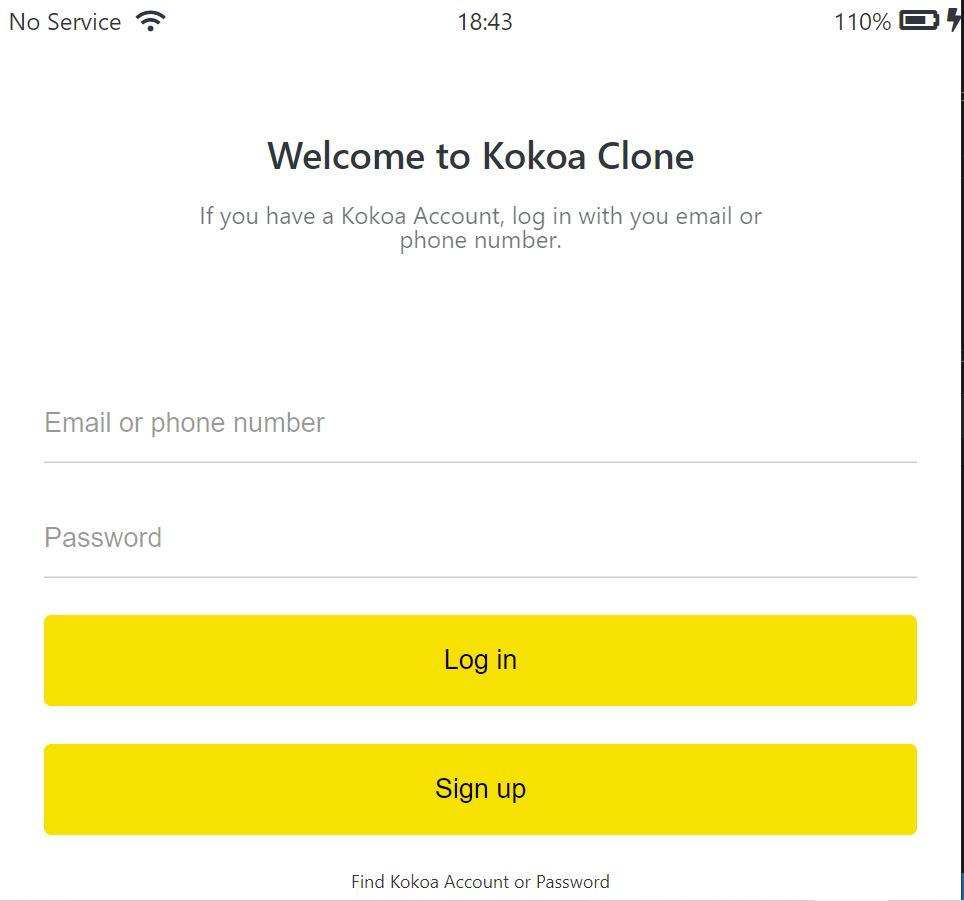
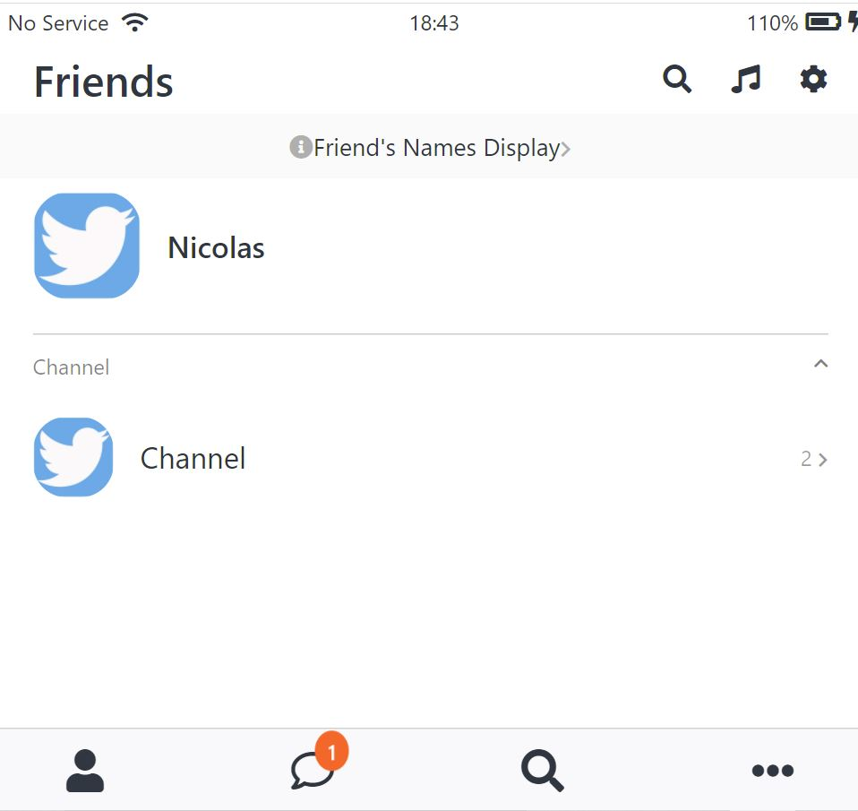
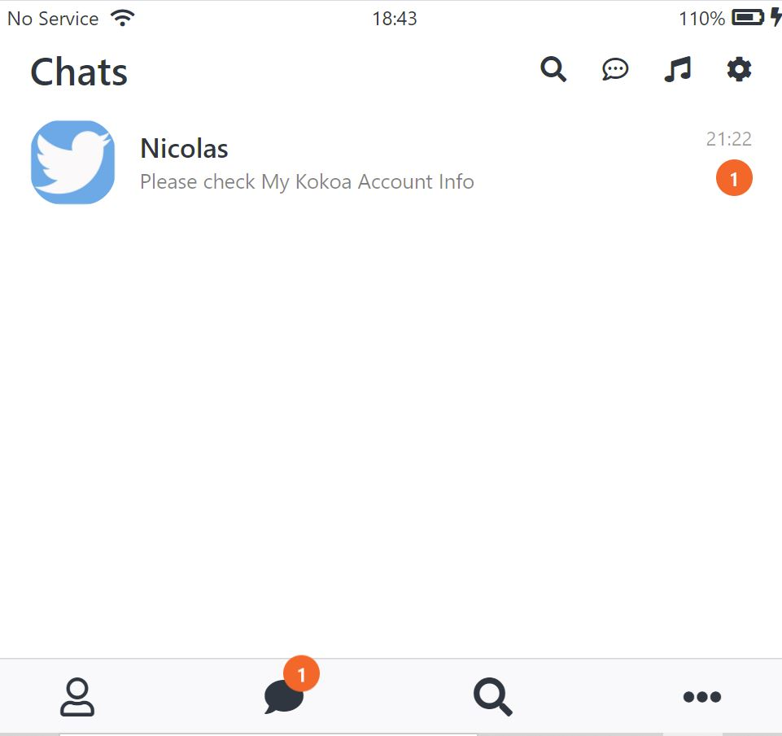
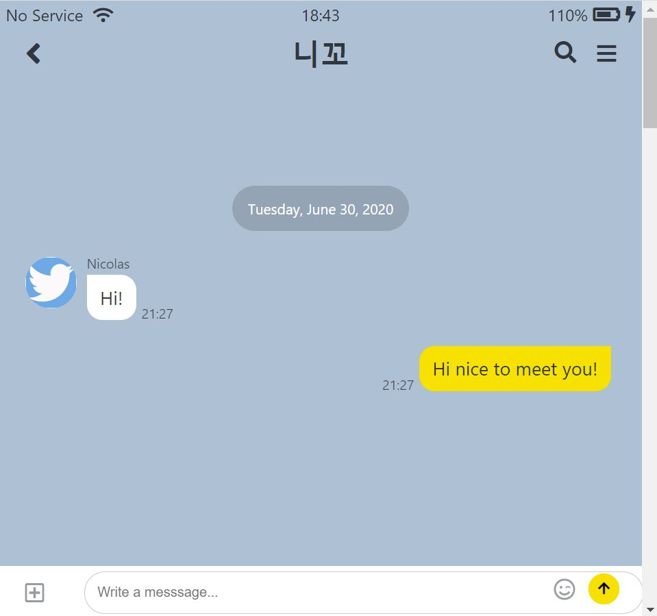
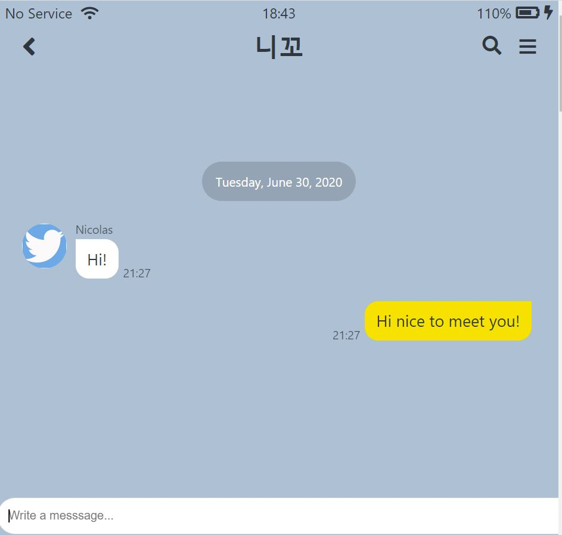
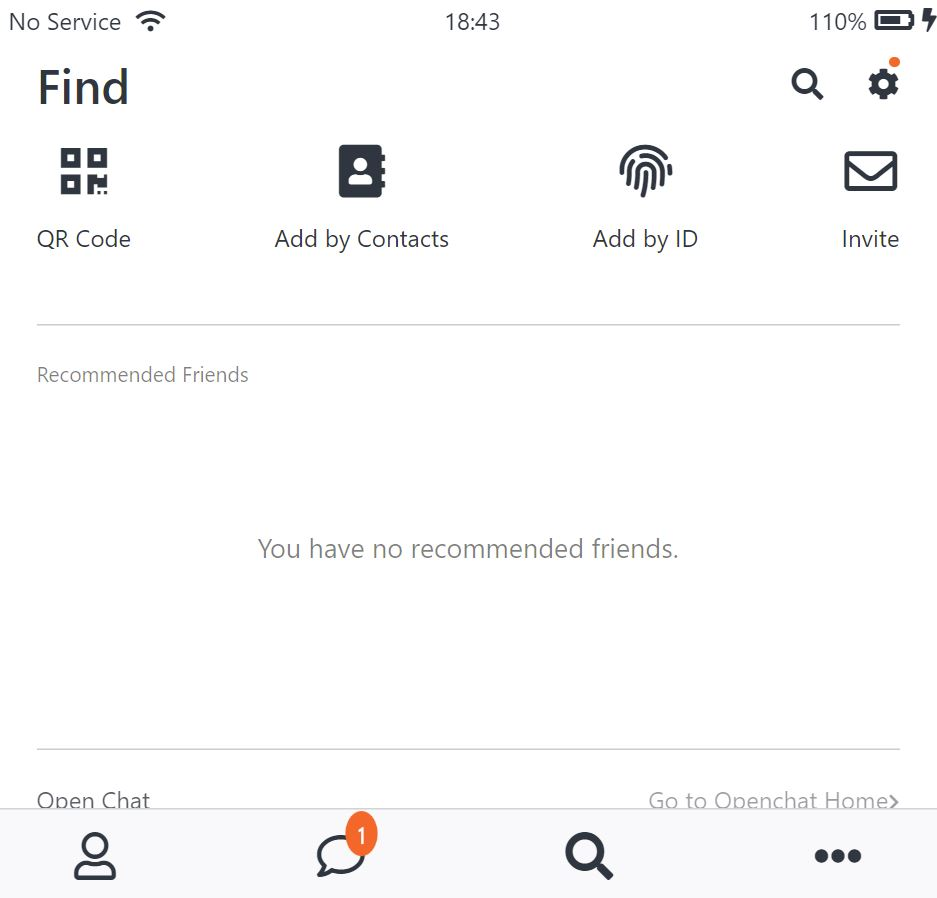
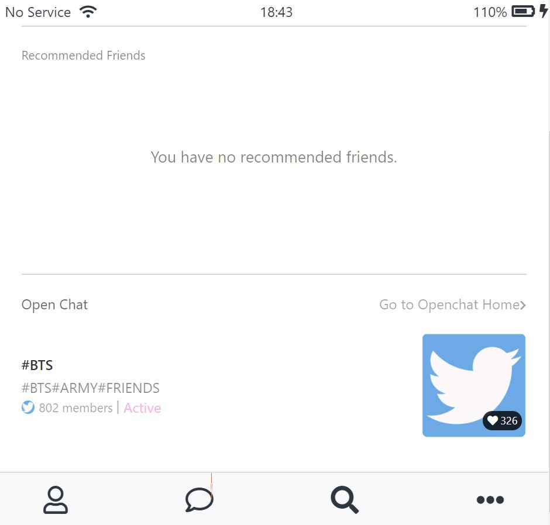
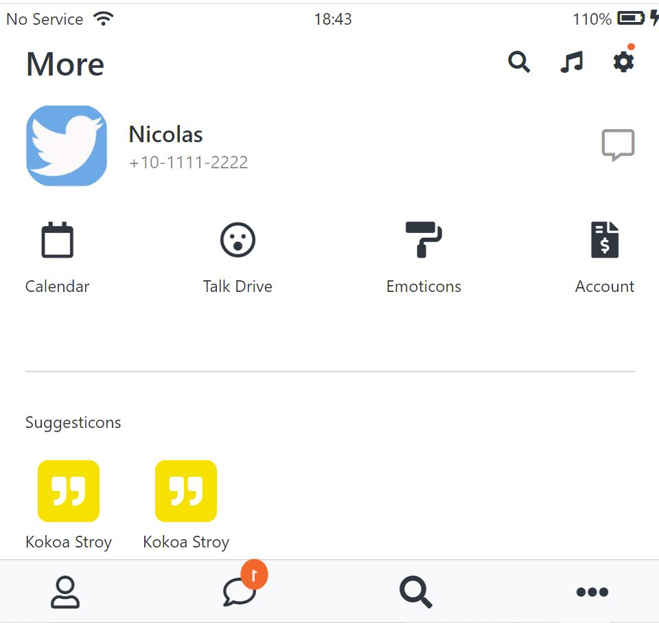
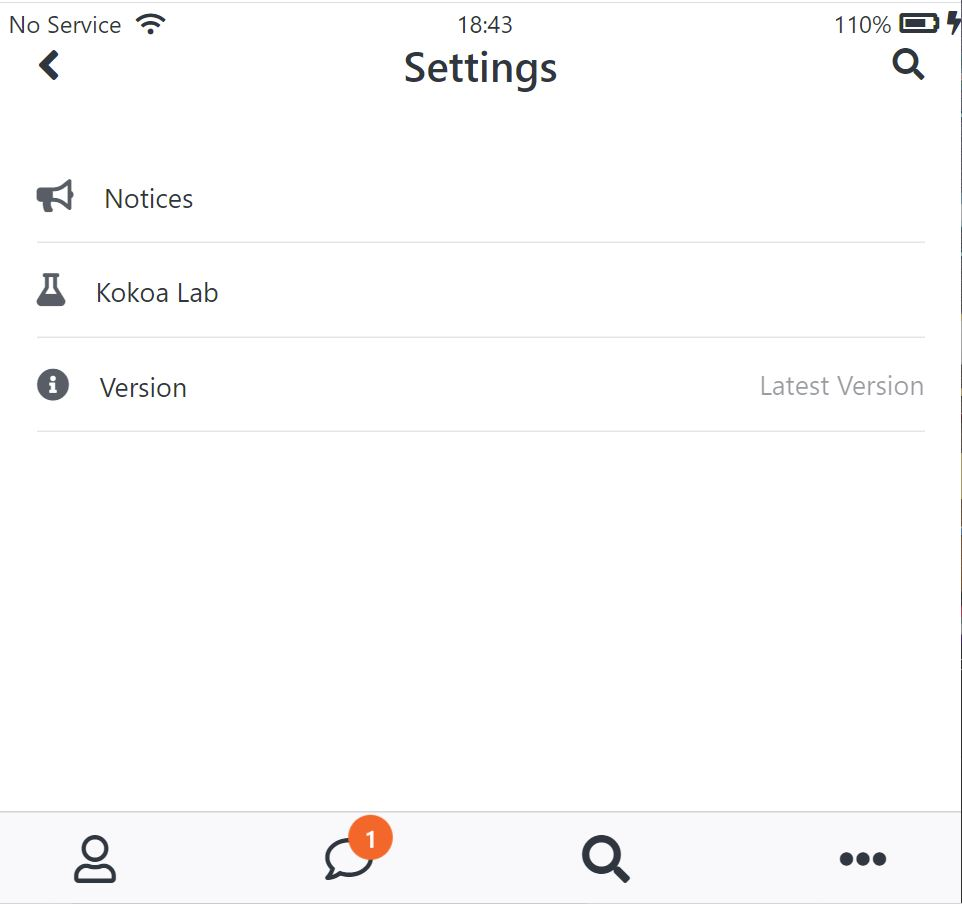

# _Kokoa Clone Code_

## 페이지 순서

### 1. 로그인 페이지

 
 

 
 

### 2. 친구 목록 페이지

 
 

### 3. 채팅 목록 페이지

 
 

### 4. 채팅 페이지

### \*\*\*입력칸 focus 없을때\*\*\*

#### \*\*\*입력칸 focus 했을때\*\*\*

 
 

### 5. 검색 페이지

 
 

### 6. 더보기 페이지

 
 

### 7. 설정 페이지

 
 

### 8. 로그인페이지에서 다른페이지로 넘어갈때

 
 

### 9. 화면크기가 일정크기를 넘었을때

 
 
# 사용한 언어

### HTML, CSS

# 클론코딩하면서 부족했던 부분

##### HTML부분은 어렵게 느껴지지 않았다.CSS도 그렇게 어렵게 느껴지지 않았으나 CSS를 이용해 애니메이션 효과를 내는 부분이 미숙했다.
